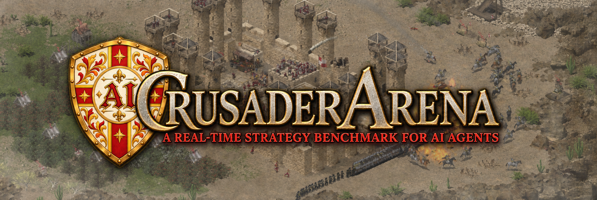
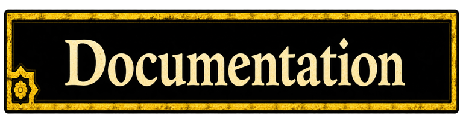
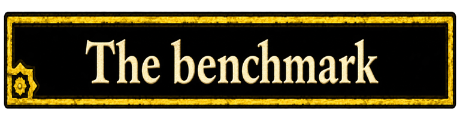

  

  <strong>A REAL-TIME STRATEGY BENCHMARK FOR AI AGENTS</strong>

  
  
  

Crusader Arena tests AI models by having them play **Stronghold Crusader: Definitive
Edition**. The model sees screenshots and plays with mouse and keyboard tools, like a
person would, helped by a small reader that supplies the numbers from the game's
panels. The benchmark asks it to grow a medieval economy from a fixed start within a
fixed amount of game time.

> [!IMPORTANT]
> **Research use only.** Crusader Arena is for studying AI agents in single-player
> games. It refuses multiplayer games; do not use it against other players. It is an
> independent project, not affiliated with or endorsed by Firefly Studios. See
> [Responsible use](#responsible-use).

https://github.com/user-attachments/assets/42a50097-a379-4ee8-889b-42a3885d26fc

*GLM 5.3 Flash playing 2 game minutes of Oasis by the Sea. The harness renders this
video from the run's recording: it shortens the thinking pauses, plays actions at real
speed and fast-forwards the waiting.*

## How it works

- **The agent** is a vision-capable language model with 27 tools: look, click, build,
  move the camera, trade, wait, and keep a plan and notes.
- **The harness** pauses the game whenever the model thinks, unpauses it for the
  model's actions, and counts only game time against the budget, so slow models are
  not penalised.
- **The reader** reads gold, goods, population, popularity, troops and on-screen
  messages from the running game, without changing any game files.
- **Every run is recorded**: each message, tool call, screenshot and reading, with an
  optional edited video.

[How it works in detail →](docs/how-it-works.md)

## Status

Research software, tested on one setup: a Mac running the harness and an Ubuntu laptop
running the game through Steam and Proton.

- Working: live play with several models, unattended benchmark episodes, net-worth
  scoring for the Oasis by the Sea scenario, run reports and videos.
- Not done yet: scoring for other scenarios, military play, a published comparison of
  models, and support for other systems or game builds.
- To run it you need your own copy of the game. An image guide to the game's menus,
  made from game screenshots, is not distributed; without it the agent gets the same
  guide as text.

[Full status and known issues →](docs/status.md)

## Documentation

| | |
| --- | --- |
| [How it works](docs/how-it-works.md) | The pieces, and one run from start to finish |
| [The benchmark](docs/benchmark.md) | Scenarios, scoring, episodes and reports |
| [The agent](docs/agent.md) · [Context](docs/context.md) · [Tools](docs/tools.md) | How the model plays and what it sees |
| [The harness](docs/harness.md) | Dashboard, run files, videos, safety boundaries |
| [Setup](docs/setup.md) | Installing both machines |
| [The reader](docs/reader.md) | Reading game state |

## Responsible use

Crusader Arena is for research on AI agents in single-player games. The reader refuses
multiplayer games, and the harness will not start or continue a run in one. Do not use
this project against other players: it breaks the game's rules, and it would not work
anyway, because the agent pauses the game every time the model thinks.

The reader loads our own code into the running game, which the game's license terms
may not permit. Use it at your own risk.

## Acknowledgements and license

Crusader Arena uses [Pi](https://github.com/earendil-works/pi) (MIT) for its agent
runtime and model integration. The code in this repository is released under the
[MIT License](LICENSE), which covers this repository only, not the game or its assets.

---

Bring your own Steam copy. Game files are not included or patched on disk. This is an independent project, not affiliated with or endorsed by Firefly Studios.
